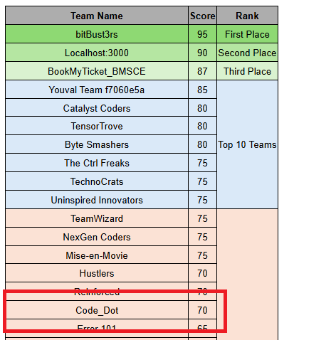

# 🎥 Movie Booking and Recommendation System

Welcome to the **Movie Booking and Recommendation System**! This project is a one-stop solution for users to browse movies, book tickets, and receive personalized movie recommendations. It integrates advanced recommendation algorithms, a user-friendly booking interface, and much more.

---

## 🎖️ Achievements

### 1. Mercer | Mettl StackHack 2.0
🏆 **Top 15 Teams out of 100** in Mercer | Mettl's full-stack coding hackathon.  
Developed a movie booking and recommendation system with:
- **Personalized recommendations** using TF-IDF and cosine similarity.
- **Real-time ticket booking** with dynamic seat selection.

  
*Our team presenting the movie booking system at StackHack 2.0.*

---
## 🚀 Features

### 1. 🎬 **Movie Recommendation Engine**
- Get personalized movie recommendations based on your favorite movies.
- Uses a **TF-IDF Vectorizer** and **cosine similarity** for accurate results.
- Smart handling of movie titles and close matches for better suggestions.

### 2. 🎟️ **Ticket Booking System**
- Intuitive seat selection interface.
- Real-time updates for available, selected, and sold-out seats.
- Easy price calculation based on selected seats.

### 3. 🍿 **Food Court**
- Convenient access to a virtual food court for snacks and beverages during movie time.

### 4. 🔐 **User and Admin Management**
- **User login** and **Admin login** features.
- Admin dashboard for managing users and bookings.

### 5. 🌟 **Multilingual and Genre Support**
- Browse movies in various languages and genres (Hindi, English, Malayalam, etc.).
- Dedicated sections for premieres, recommended movies, and popular picks.

---

## 🛠️ Technologies Used
- **Frontend**: HTML, CSS, JavaScript, Bootstrap
- **Backend**: Flask (Python)
- **Machine Learning**: Scikit-learn for recommendation models
- **Database**: CSV-based movie dataset
- **Other Tools**: Pickle for saving ML models, Difflib for matching similar titles

---

## 📚 How It Works

### Recommendation System
1. Combines features like genres, keywords, taglines, cast, and director.
2. Vectorizes the combined features using **TF-IDF Vectorizer**.
3. Calculates similarity scores with a precomputed matrix.
4. Returns the top 10 movie recommendations.

### Booking System
- **Dynamic Seat Map**: Select seats visually.
- **Pricing Logic**: Updates ticket prices based on seat selections.
- **Local Storage**: Saves user preferences for better UX.

---

## 📂 Project Structure
project/
├── templates/            # HTML templates for the web pages
│   ├── index.html        # Main page of the application
│   ├── booking.html      # Movie booking page
│   ├── recommend_movie.html # Movie recommendation page
│   └── login.html        # Login page for users and admins
│
├── static/               # Static assets like CSS, images, and JavaScript
│   ├── css/              # Stylesheets
│   ├── img/              # Images
│   ├── js/               # JavaScript files
│
├── app.py                # Flask application script
├── vectorizer.pkl        # TF-IDF vectorizer model for movie recommendations
├── similarity.pkl        # Precomputed similarity matrix
├── movies.csv            # Dataset containing movie details
└── README.md             # Documentation for the project

---

## 🌟 Getting Started


### File and Folder Descriptions

- **templates/**  
  Contains HTML templates for different pages rendered by Flask:
  - `index.html`: The homepage where users can browse the app.
  - `booking.html`: The page for selecting and booking movie tickets.
  - `recommend_movie.html`: Displays personalized movie recommendations.
  - `login.html`: Login page for user and admin authentication.

- **static/**  
  Houses static files such as CSS, images, and JavaScript:
  - **css/**: Custom stylesheets used throughout the application.
  - **img/**: Images used in the project (e.g., movie posters).
  - **js/**: JavaScript files for additional functionality (e.g., form validation).

- **app.py**  
  The main script of the Flask application. It handles backend routes, user interactions, movie recommendations, and more.

- **vectorizer.pkl**  
  A serialized TF-IDF vectorizer model used to process movie descriptions and recommend movies based on similarity.

- **similarity.pkl**  
  A precomputed similarity matrix that helps in making fast and efficient movie recommendations by calculating the similarity between movies.

- **movies.csv**  
  A dataset containing movie details such as titles, genres, and descriptions, used for the recommendation system.

- **README.md**  
  Documentation for the project, providing setup instructions, features, and usage guidelines.

---

## Setup Instructions

To get started with this project, follow these steps:

1. **Clone the Repository**
   ```bash
   git clone https://github.com/yourusername/movie-booking-system.git
2. **Install Dependencies Create a virtual environment and install the required Python packages:**
    ```bash 
      cd movie-booking-system
      python3 -m venv venv
      source venv/bin/activate  
      # On Windows, use     venv\Scripts\activate`
    ```pip install -r requirements.txt
3. **Run the Application**
     ```bash 
     python app.py


## Features
Movie Booking: Users can browse movies and book tickets through the app.
Movie Recommendations: The app provides personalized movie recommendations based on the user's preferences and movie similarities.
User Authentication: Login functionality for both users and administrators.


## License
This project is licensed under the MIT License - see the LICENSE file for details.

## Acknowledgements
The movie recommendation system uses TF-IDF for vectorization and cosine similarity for calculating movie similarity.
Special thanks to the contributors and the open-source community for making this project possible.
